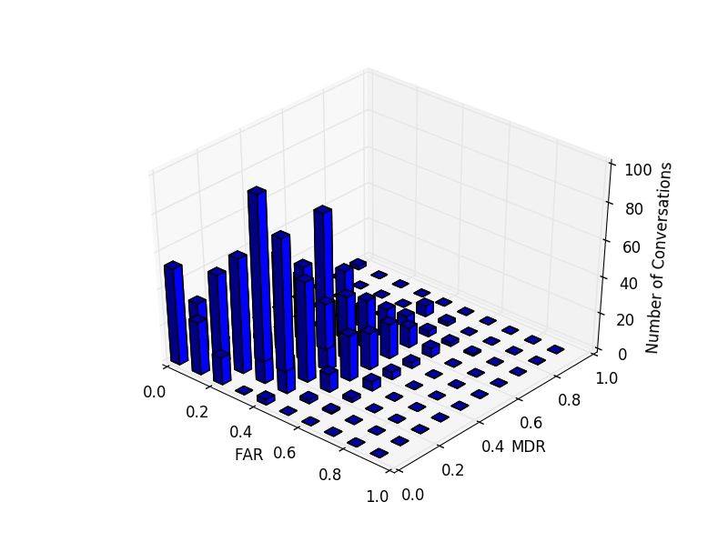
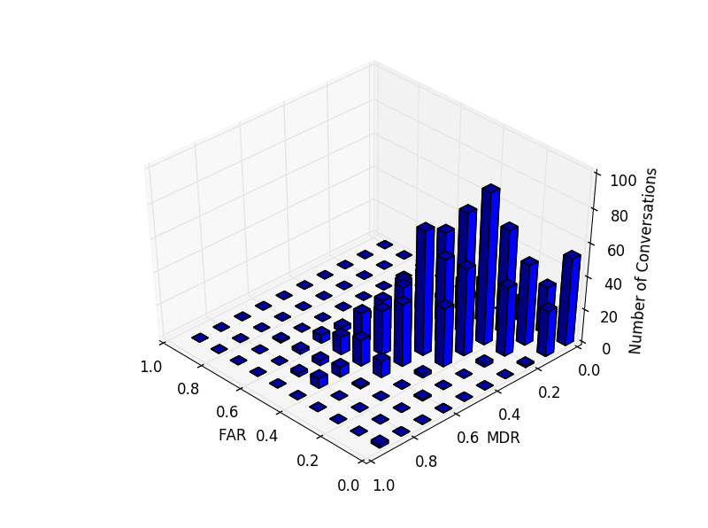
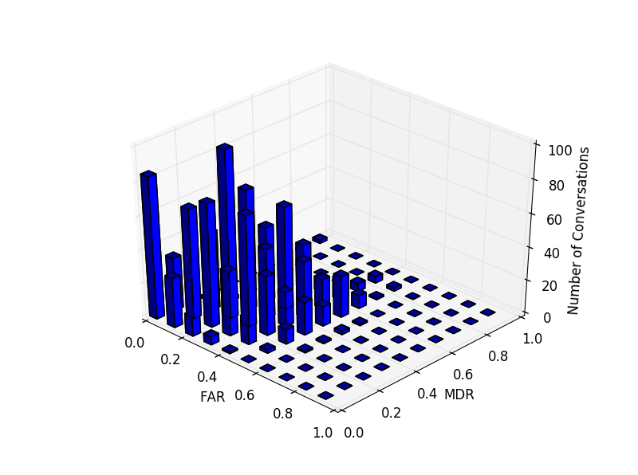
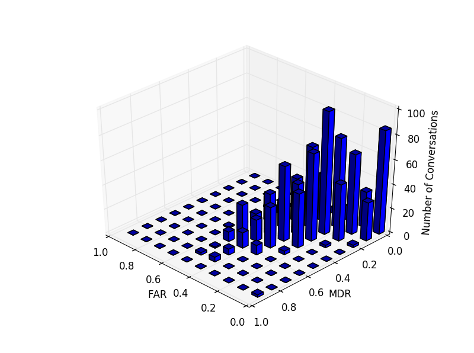

## d-vector speaker segmentation in THU emotion dataset

No. conversations: 1,601

No. change points: 32,992

Tolerance: 0.3 seconds

### Sliding threshold:
FAR and MDR evolution of three tolerances:

### local minimum detection:

- detected points: 233,472
- false alarm: 185,074
- miss detection: 5,428
- FAR: 83.85%
- MDR: 16.62%

### k-means clustering:
- detected points: 42,148
- false alarm: 19,468
- miss detection: 11,177
- FAR: 31.59% (var: 3.295)
- MDR: 33.97% (var: 3.327)

The distribution of the two error rate in the dataset

### known two speakers -5 segments to train model:
- detected points: 40,849
- false alarm: 17,622
- miss detection: 10,341
- FAR: 31.70% (var: 2.031)
- MDR: 31.48% (var: 2.772)

The distribution of the two error rate in the dataset

### known two speakers -all segments to train model:
- detected points: 39,011
- false alarm: 14,988
- miss detection: 9,473
- FAR: 28.46% (var: 1.950)
- MDR: 28.84% (var: 2.605)

The distribution of the two error rate in the dataset

