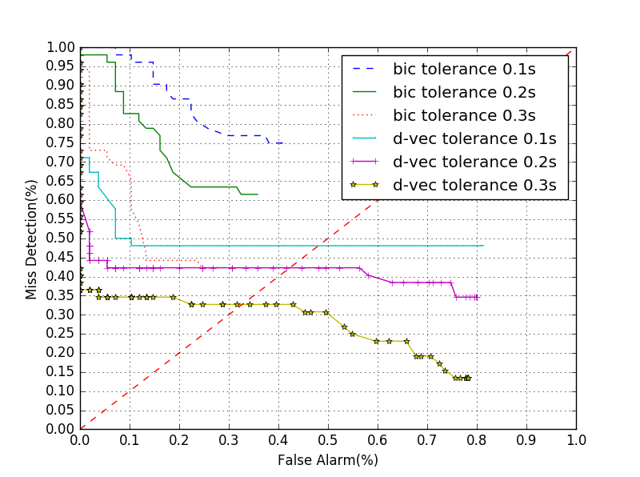
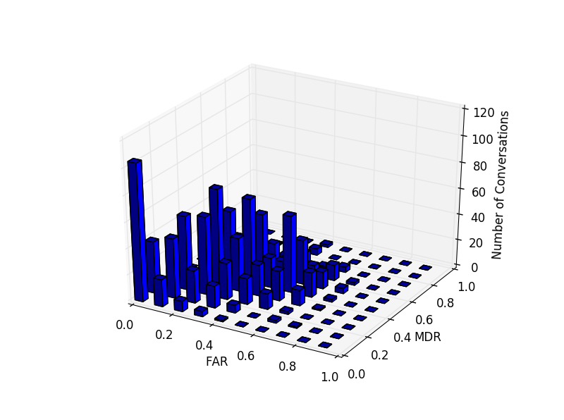
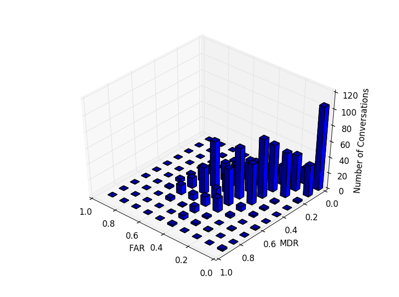

## d-vector speaker segmentation in THU emotion dataset

No. conversations: 1,601
No. change points: 32,992
Tolerance: 0.3 seconds

- Sliding threshold:
FAR and MDR evolution of three tolerances:

- local minimum detection:

detected points: 233,472
false false: 185,074
miss detection: 5,428
FAR: 83.85%
MDR: 16.62%

- k-means clustering:
detected points: 42,148
false false: 19,468
miss detection: 11,177
FAR: 31.59%
MDR: 33.97%

The distribution of the tow error rate in the dataset

