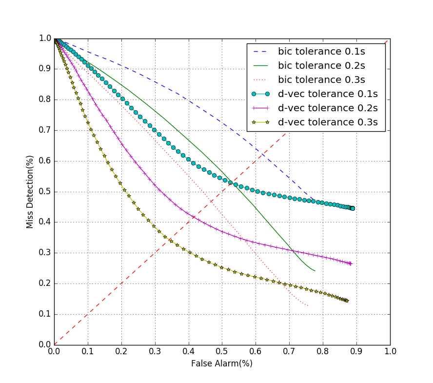

## d-vector speaker segmentation in THU emotion dataset

No. conversations: 1,601

No. change points: 32,992

Tolerance: 0.3 seconds

### Sliding threshold:
FAR and MDR evolution of three tolerances:

### local minimum detection:

- detected points: 233,472
- false alarm: 185,074
- miss detection: 5,428
- FAR: 83.85%
- MDR: 16.62%

### k-means clustering:
- detected points: 42,148
- false alarm: 19,468
- miss detection: 11,177
- FAR: 31.59% (var: 3.295)
- MDR: 33.97% (var: 3.327)

The distribution of the two error rate in the dataset

#### F-F
- test case: 487
- real change point: 15,303
- detected points: 230,81
- false alarm: 12,515
- miss detection: 5,493
- FAR: 40.25%
- MDR: 35.88%

#### M-M
- test case: 168
- real change point: 5,134
- detected points: 6,258
- false alarm: 3,389
- miss detection: 2,290
- FAR: 34.86%
- MDR: 44.55%

#### M-F
- test case: 406
- real change point: 12,555
- detected points: 12,809
- false alarm: 3,564
- miss detection: 33,94
- FAR: 19.79%
- MDR: 27.30%

### known two speakers -5 segments to train model:
- detected points: 40,849
- false alarm: 17,622
- miss detection: 10,341
- FAR: 31.70% (var: 2.031)
- MDR: 31.48% (var: 2.772)

The distribution of the two error rate in the dataset

### known two speakers -all segments to train model:
- detected points: 39,011
- false alarm: 14,988
- miss detection: 9,473
- FAR: 28.46% (var: 1.950)
- MDR: 28.84% (var: 2.605)

The distribution of the two error rate in the dataset

#### F-F
- test case: 494
- real change point: 15,506
- detected points: 200,73
- false alarm: 8,234
- miss detection: 4,065
- FAR: 32.47%
- MDR: 26.17%

#### M-M
- test case: 168
- real change point: 5,134
- detected points: 6,131
- false alarm: 3,097
- miss detection: 2,145
- FAR: 35.21%
- MDR: 41.78%

#### M-F
- test case: 399
- real change point: 12,332
- detected points: 12,807
- false alarm: 3,657
- miss detection: 3,263
- FAR: 20.65%
- MDR: 26.72%

## Design of software

### feature extraction: d-vector (with kaldi toolkit)

input: wavfile, nnet, wavlist

output: d-vector feature files (with pca feature dimensionality reduction)

### bic, glr, kl2 segmentation

input: mfcc sequences (numpy array), window_size, window_shift

output: score curves, initial segmentation blocks(start_time, end_time)

### d-vector segmentation

input: d-vector sequences (numpy array), window_size, window_shift

output: score curves, initial segmentation blocks(start_time, end_time)

### generate segmentation blocks with fixed_threshold

input: score curves (bic, glr, kl2, d-vector)

output: new segmentation blocks

### blind resegmentation k-means clustering (default k=2)

input: initial segmentation blocks

output: new segmentation blocks, speaker tag

### resegmentation with speaker models

input: initial segmentation blocks, speaker models

output: new segmentation blocks, speaker tag

### evalution

FAR, MDR: segmentation blocks, ref file, tolerance

DET curves with sliding threshold: d-vector score curves(list), ref file(list)

ASP, ACP: segmentation blocks, speaker tag, ref file(with speaker tag)

speaker1_false_rate, speaker1_miss_rate, speaker2_false_rate, speaker2_miss_rate: segmentation blocks, speaker tag, ref file(with speaker tag). - divided by speaker1 and speaker2

### warning:
- single converation segmentation and list segmentation configuration, especially in sliding threshold evluation

