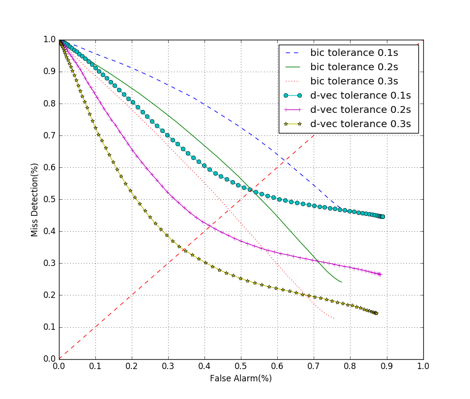

# Dvec_seg documentation
## 前言

Dvec_seg 是一个基于深度神经网络的说话人分割工具。该工具使用python编写、运行和测试。工具利用深度神经网络提取说话人区分性特征，并采用滑动窗检测的方法进行说话人分割。同时工具也提供基于距离度量的说话人分割实现，如传统的基于bic、glr、kl2的分割方法实现。使用本工具依赖Kaldi语音识别工具箱进行语音信号的特征提取，深度神经网络的训练和深度说话人向量的提取，此外还使用scikit-learn机器学习工具包。详细过程参见文献[1]。

## 主要模块介绍

### 语音特征提取部分

使用kaldi语音识别工具箱进行预处理和特征提取，包括：MFCC、Fbank、d-vector以及静音检测部分。详见fea_extract.sh文件。

### 深度神经网络训练部分

详细部分参考 deep speaker vector 网络的训练[2]。

### 初始分割部分

```python
# initial_seg.py
scores, times, det_time, det_index = initial_seg(feat_vad, feat_time, win_len, win_shift, dist, lamda=1.5)
```
输入参数：

- feat_vad: 经过vad处理后的特征序列，序列可以为MFCC、Fbank、d-vector其中的任意一种
- feat_time: 每一列特征序列所对应的时间点
- win_len: 分割检测窗长
- win_shift: 分割检测窗移
- dist: 距离度量方法，可以选择'bic'、'glr'、'kl2'、'dvec'四种方法进行初始分割
- lamda: 当选择'bic'作为距离度量时需要设置lamda值

输出参数：

- scores: 距离分数序列
- times: 距离分数序列对应的时间点
- det_time: 按照极值点的分割结果（时间点）
- det_index: 按照极值点的分割结果（序列标签）

### 固定阈值分割部分

```python
# initial_seg.py
det_time = fix_slid_det_bic(times, scores, threshold)
```
输入参数：

- scores: 距离分数序列
- times: 距离分数序列对应的时间点
- threshold: 分割阈值

输出参数：

- det_time: 分割结果（时间点）

```python
# initial_seg.py
det_time = fix_slid_det_dvec(times, scores, threshold)
```
输入参数：

- scores: 距离分数序列
- times: 距离分数序列对应的时间点
- threshold: 分割阈值

输出参数：

- det_time: 分割结果（时间点）

### 说话人聚类部分

#### K-means 无监督说话人聚类合并

```python
# spk_cluster_reseg.py
change_point, segment_result, spk_model = spk_k_means_cluster(det_index, feat_vad, feat_time, type)
```
输入参数：

- det_index: 初始分割中按照极值点的分割结果（序列标签）
- feat_vad: 经过vad处理后d-vector的特征序列
- feat_time: 每一列特征序列所对应的时间点
- type: 聚类完成后得到的说话人模型表示:选择'mean'为均值处理，'svm'为使用svm建模

输出参数：

- change_point: 聚类合并后的变换点结果（序列标签）
- segment_result: 聚类合并后的说话人标记结果 （[[起始时间, 结束时间], 说话人标记]的列表）
- spk_model: 聚类合并后得到的说话人模型

#### 已知说话人数据(模型)的聚类合并
```python
# spk_cluster_reseg.py
change_point, segment_result = spk_reseg_with_models(det_index, feat_vad, feat_time, spk_model)
```
输入参数：

- det_index: 初始分割中按照极值点的分割结果（序列标签）
- feat_vad: 经过vad处理后d-vector的特征序列
- feat_time: 每一列特征序列所对应的时间点
- spk_model: 说话人模型，这里使用d-vector的均值，可以根据具体需要自行修改

输出参数：

- change_point: 聚类合并后的变换点结果（序列标签）
- segment_result: 聚类合并后的说话人标记结果 （[[起始时间, 结束时间], 说话人标记]的列表）


### 性能评价部分

#### 说话人分割（变换点检测）性能评价
```python
# evaluation.py
total, det, false_alarm, miss_det, FAR, MDR, RCL, RRL = seg_evlaution(det_time, ref_f, ft)
```
输入参数：

- det_time: 分割结果（时间点）
- ref_f: 真实变换点时间段区间
- ft: 检测时间差容忍度

输出参数：

- total: 所有的变换点个数
- det: 检测出的变换点个数
- false_alarm: 误警的变换点个数
- miss_det: 漏检的变换点个数
- FAR: 误警率
- MDR: 漏检率
- RCL: 回召率
- RRL: 精准率

#### 说话人聚类性能评价
```python
# evaluation.py
ACP, ASP = cluster_evluation(ref, cluster_result)
```

输入参数：

- ref: 真实说话人标签列表
- cluster_result: 聚类后的说话人标记结果 （[[起始时间, 结束时间], 说话人标记]的列表）

输出参数：

- ACP: 平均类纯度
- ASP: 平均说话人纯度

## 使用案例

### 语音特征提取
```bash
# fea_extract.sh
data=$1
compute-mfcc-feats --config=conf/mfcc.conf scp:$data/wav.scp ark,t,scp:$data/mfcc_feats.ark,$data/mfcc_feats.scp
compute-vad --config=conf/vad.conf scp:$data/mfcc_feats.scp ark,t,scp:$data/mfcc_vad.ark,$data/mfcc_vad.scp
compute-fbank-feats --config=conf/fbank.conf scp:$data/wav.scp ark,t,scp:$data/fbank_feats.ark,$data/fbank_feats.scp
compute-vad --config=conf/vad.conf scp:$data/fbank_feats.scp ark,t,scp:$data/fbank_vad.ark,$data/fbank_vad.scp
nnet3-compute --use-gpu=no nnet/final.last_hid.raw ark:$data/fbank_feats.ark ark,t,scp:$data/dvector.ark,$data/dvector.scp
```

### THU_EV_1062 双人对话语音数据库分割（变换点检测）

- 按照kaldi语音工具箱格式准备lst文件列表如下
```
# lst/thu_ev.lst
# 文件名 文件语音路径
F060HNA_F059NVA_002 /nfs/user/wangrenyu/data/thu_ev_xmx_1/thu_ev_wav/F060HNA_F059NVA_002.wav
F057KPN_F058VAN_005 /nfs/user/wangrenyu/data/thu_ev_xmx_1/thu_ev_wav/F057KPN_F058VAN_005.wav
F033PKN_F032ANH_005 /nfs/user/wangrenyu/data/thu_ev_xmx_1/thu_ev_wav/F033PKN_F032ANH_005.wav
F029HJN_M016VAN_001 /nfs/user/wangrenyu/data/thu_ev_xmx_1/thu_ev_wav/F029HJN_M016VAN_001.wav
F047JHN_F046VAN_001 /nfs/user/wangrenyu/data/thu_ev_xmx_1/thu_ev_wav/F047JHN_F046VAN_001.wav
F049JNV_F048ANV_004 /nfs/user/wangrenyu/data/thu_ev_xmx_1/thu_ev_wav/F049JNV_F048ANV_004.wav
M003NJH_F009VNH_001 /nfs/user/wangrenyu/data/thu_ev_xmx_1/thu_ev_wav/M003NJH_F009VNH_001.wav

```

- 执行 local/demo.py 中的 pre_processing() 和 feat_extraction() 两个函数进行文件预处理和特征提取

```python
pre_processing()
feat_extraction()
```

- 滑动阈值，生成det曲线所必要的一些列点，并得到等错误率下的阈值取值，为了进行对比，对bic和d-vector两种分割方法在不同的错误容忍度下的性能进行的测试


```python
from spk_cluster_reseg import *
from evaluation import *
from initial_seg import *

def det_eer(lst_filename, seg_type, ft):
    full_scores, scores_c, times_c, ref_c = [], [], [], []
    eer_x, eer_y, eer_t = [], [], []
    for i in file(lst_filename).readlines():
        utt = i.split()[0]
        if seg_type=='dvec':
            scores, times, det_time, det_index = initial_segmentation('data/'+utt+'/dvector.ark', 'data/'+utt+'/fbank_vad.ark', 400, 0.1, 0.01, seg_type)
        else:
            scores, times, det_time, det_index = initial_segmentation('data/'+utt+'/mfcc_feats.ark', 'data/'+utt+'/mfcc_vad.ark', 20, 1, 0.1, seg_type)
        ref_segment = gen_ref_seg('thu_ev_tag/'+utt+'.txt')
        scores_c.append(scores)
        times_c.append(times)
        ref_c.append(ref_segment)
        full_scores.extend(scores)
    thr = np.linspace(min(full_scores), max(full_scores), 100)
    for T in thr:
        false_alarm, miss_det, total = 0, 0, 0
        for index, scores in enumerate(scores_c):
            if seg_type=='dvec':
                det_tmp = fix_slid_det_dvec(times_c[index], scores, float(T))
            else:
                det_tmp = fix_slid_det_bic(times_c[index], scores, float(T))
            det = []
            for i in det_tmp:
                if i > ref_c[index][0][0] and i < ref_c[index][-1][-1]:
                    det.append(i)
            for i in det:
                if not inline(float(i), ref_c[index], ft):
                    false_alarm += 1
            for i in ref_c[index]:
                if not inpoint(i, det, ft):
                    miss_det += 1

            total += len(ref_c[index])
        FAR = float(false_alarm)/(total+false_alarm)
        MDR = float(miss_det)/total
        print T,
        print FAR,
        print MDR
        #print false_alarm, miss_det, total
        eer_x.append(FAR)
        eer_y.append(MDR)
        eer_t.append(T)
    dist = []
    for index, each in enumerate(eer_x):
        dist.append(abs(each - eer_y[index]))
    ii = dist.index(min(dist))
    print eer_x[ii], eer_y[ii], eer_t[ii]

det_eer('lst/thu_ev.lst', 'bic', 0.3)
det_eer('lst/thu_ev.lst', 'bic', 0.2)
det_eer('lst/thu_ev.lst', 'bic', 0.1)
det_eer('lst/thu_ev.lst', 'dvec', 0.3)
det_eer('lst/thu_ev.lst', 'dvec', 0.2)
det_eer('lst/thu_ev.lst', 'dvec', 0.1)
```
- 利用可视化工具展现对比实验结果

### BIC 变换点检测

- 基于BIC距离度量的变换点检测，并采用固定阈值的方法进行一定置信度的分割，阈值的选择可根据环境经验选择

```python
from spk_cluster_reseg import *
from evaluation import *
from initial_seg import *

mfcc_file = 'data/F001HJN_F002VAN_001/mfcc_feats.ark' # 20 dim
vad_file = 'data/F001HJN_F002VAN_001/mfcc_vad.ark'

# load MFCC feature and vad result
utt_lable, feat_content = readfeatfromkaldi(mfcc_file, 20)
vad_utt_label, vad_content = readvadfromkaldi(vad_file)

# remove silence regions
feat_vad, feat_time = gen_feat_vad(feat_content, vad_content)

# initial segmentation
scores, times, det_time, det_index = initial_seg(feat_vad, feat_time, 1, 0.1, 'bic', lamda=1.0)
print times

# fixed threshold segmentation
det_tmp = fix_slid_det_bic(times, scores, 0)
print det_tmp
```

### d-vector 说话人分割聚类

- 基于d-vector的说话人分割距离，首先采用滑动窗检测的方法，根据两窗直接的d-vector距离计算变换点似然度，然后在似然度大的位置进行分割;对分割后生成的小段进行无监督的聚类，进而合并小段得到语音的说话人标签信息;此外实验还测试了根据已知的说话人模型信息对小段进行合并重分割的结果，实验结果明显由于前者，实验过程如下：

```python
from spk_cluster_reseg import *
from evaluation import *
from initial_seg import *

dvector_file = 'data/F001HJN_F002VAN_001/dvector.ark' # 400 dim
vad_file = 'data/F001HJN_F002VAN_001/fbank_vad.ark'

# load d-vector feature and vad result
utt_lable, feat_content = readfeatfromkaldi(dvector_file, 400) 
vad_utt_label, vad_content = readvadfromkaldi(vad_file)

# remove silence regions
feat_vad, feat_time = gen_feat_vad(feat_content, vad_content)

# initial segmentation
scores, times, det_time, det_index = initial_seg(feat_vad, feat_time, 0.1, 0.01, 'dvec')

# k-means clustering from initial segmentation
change_point, segment_result, spk_model = spk_k_means_cluster(det_index, feat_vad, feat_time, 'svm')

# transform index of features to time points
det_time = [frame2time(feat_time[i], mfcc_shift) for i in change_point]
cluster_result = [[[frame2time(feat_time[i[0][0]], mfcc_shift), frame2time(feat_time[i[0][1]], mfcc_shift)], i[1]] for i in segment_result]

# load change points labels and speaker labels
ref_segment = gen_ref_seg('thu_ev_tag/F001HJN_F002VAN_001.txt')
ref = read_ref('thu_ev_tag/F001HJN_F002VAN_001.txt')

# evlaution
init_e = seg_evlaution(det_time, ref_segment, 0.3)
cluster_e = cluster_evluation(ref, cluster_result)
print 'K-means clustering:'
print init_e
print cluster_e

# resegmentation with speaker models
spk_model = get_spk_model(feat_content, 'F001HJN_F002VAN_001')
change_point, segment_result = spk_reseg_with_models(det_index, feat_vad, feat_time, spk_model)
det_time = [frame2time(feat_time[i], mfcc_shift) for i in change_point]
cluster_result = [[[frame2time(feat_time[i[0][0]], mfcc_shift), frame2time(feat_time[i[0][1]], mfcc_shift)], i[1]] for i in segment_result]

# evlaution
init_e = seg_evlaution(det_time, ref_segment, 0.3)
cluster_e = cluster_evluation(ref, cluster_result)
print 'resegmentation with speaker models:'
print init_e
print cluster_e
```

- THU_EV_1062的实验结果

不同容忍度下BIC分割和d-vector分割的DET曲线对比



聚类和重分割后错误率对比

  method                                                       |  FAR |  MDR |  ACP | ASP
---------------------------------------------------------------|------|------|------|------
fixed threshold + EER (BIC)                                    |44.54%|49.59%|------|------
fixed threshold + EER (D-vector)                               |34.79%|33.83%|------|------
initial segmentation + k-means (D-vector)                      |32.85%|33.46%|68.44%|74.52%
initial segmentation + speaker model re-segmentation (D-vector)|26.20%|26.57%|74.38%|80.68%

## 参考文献

> [1] Renyu Wang, Mingliang Gu, Lantian Li, Mingxing Xu, Thomas Fang Zheng, “Speaker Segmentation using Deep Speaker Vectors for Fast Speaker Change Scenarios,” International Conference on Acoustics, Speech and Signal Processing (ICASSP’17), pp. 5420-5424, Mar. 5-9, 2017, New Orleans, Louisiana, USA

> [2] Li L, Wang D, Zhang Z, et al. Deep speaker vectors for semi text-independent speaker verification[J]. arXiv preprint arXiv:1505.06427, 2015.
